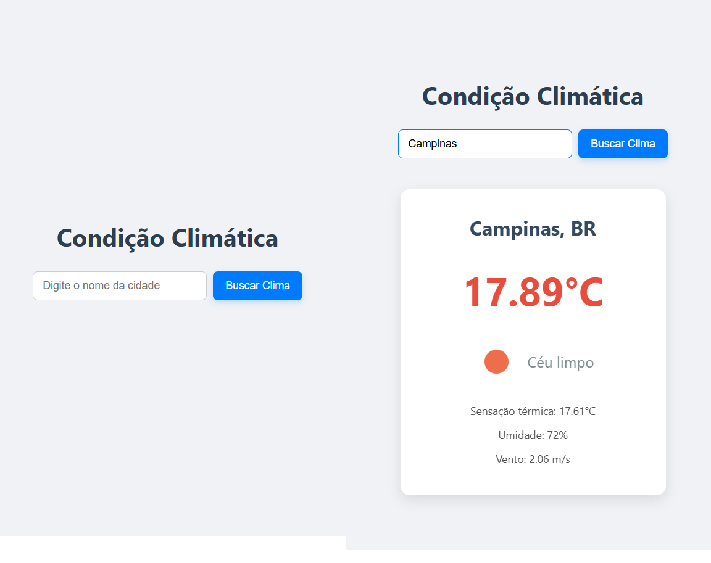

# Weather-App: Condição Climática Simples

Um aplicativo web interativo para verificar a condição climática em tempo real de qualquer cidade globalmente.

---

##  O que este App Faz

O `Weather-App` é um projeto front-end construído com **React.js** que consome a **OpenWeatherMap API** para fornecer informações climáticas.

**Com ele, você pode:**
* Pesquisar o clima de qualquer cidade do mundo.
* Visualizar a temperatura atual, sensação térmica, umidade e velocidade do vento.
* Obter uma descrição do clima (ex: "Céu Limpo", "Nublado") e um ícone correspondente.

**A API faz:** A **OpenWeatherMap API** é a responsável por nos fornecer todos os dados climáticos (temperatura, descrição, ícones, etc.) quando você digita o nome de uma cidade. O aplicativo envia sua requisição para a API, e ela retorna as informações que são então exibidas na tela.

---

## Tecnologias Principais

* **React.js:** Para a construção da interface do usuário.
* **HTML5 & CSS3:** Estrutura e estilização do aplicativo.
* **JavaScript (ES6+):** Lógica e interatividade.
* **Fetch API:** Para realizar as requisições à API.
* **OpenWeatherMap API:** Fonte dos dados climáticos.

---

## Prévia do App

---

## Conecte-se Comigo

* **LinkedIn:** [linkedin.com/in/pedro-augusto-25b843217](https://www.linkedin.com/in/pedro-augusto-25b843217)
